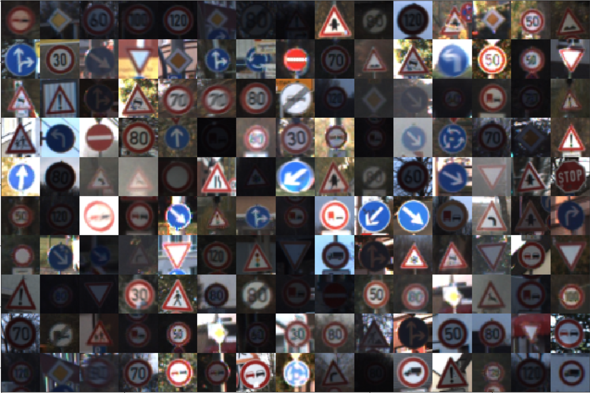
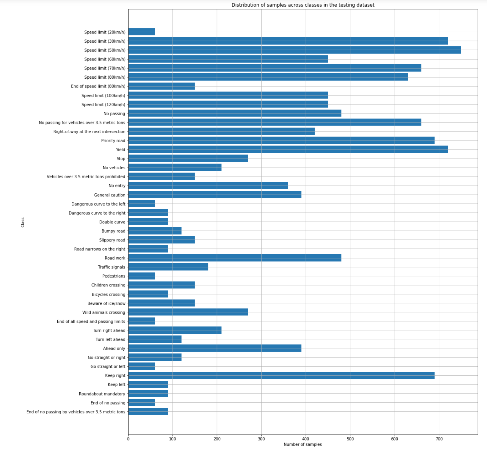
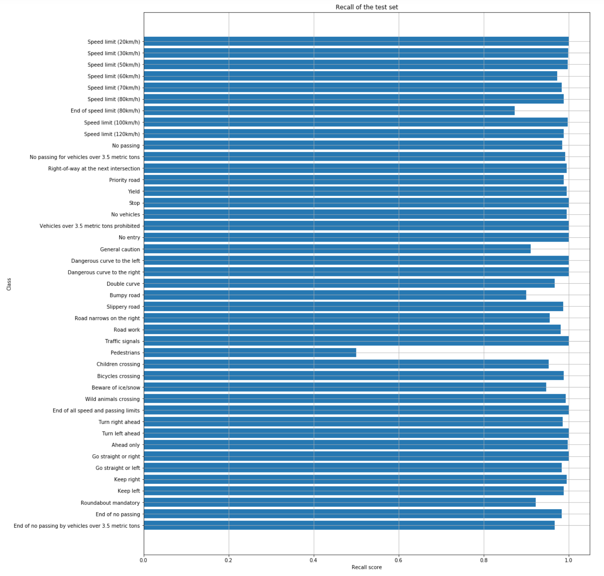

# **Traffic Sign Recognition** 

## Writeup

### You can use this file as a template for your writeup if you want to submit it as a markdown file, but feel free to use some other method and submit a pdf if you prefer.

---

**Build a Traffic Sign Recognition Project**

The goals / steps of this project are the following:
* Load the data set (see below for links to the project data set)
* Explore, summarize and visualize the data set
* Design, train and test a model architecture
* Use the model to make predictions on new images
* Analyze the softmax probabilities of the new images
* Summarize the results with a written report

## Rubric Points
### Here I will consider the [rubric points](https://review.udacity.com/#!/rubrics/481/view) individually and describe how I addressed each point in my implementation.  

---
### Writeup / README

#### 1. Provide a Writeup / README that includes all the rubric points and how you addressed each one. You can submit your writeup as markdown or pdf. You can use this template as a guide for writing the report. The submission includes the project code.

You're reading it!

### Data Set Summary & Exploration

#### 1. Provide a basic summary of the data set. In the code, the analysis should be done using python, numpy and/or pandas methods rather than hardcoding results manually.

I used the pandas library to calculate summary statistics of the traffic
signs data set:

* The size of training set is 34799
* The size of the validation set is 4410
* The size of test set is 12630
* The shape of a traffic sign image is (32, 32, 3)
* The number of unique classes/labels in the data set is 43

#### 2. Include an exploratory visualization of the dataset.

In the following figure a sample of the data set is shown:

The distribution of the classes in the training set:

The distribution of the classes in the validation set:

The distribution of the classes in the testing set:

As we can see from the figures above, the classes are not balanced. Some have almost 10 times more samples than the others.

### Design and Test a Model Architecture

#### 1. Describe how you preprocessed the image data. What techniques were chosen and why did you choose these techniques? Consider including images showing the output of each preprocessing technique. Pre-processing refers to techniques such as converting to grayscale, normalization, etc. (OPTIONAL: As described in the "Stand Out Suggestions" part of the rubric, if you generated additional data for training, describe why you decided to generate additional data, how you generated the data, and provide example images of the additional data. Then describe the characteristics of the augmented training set like number of images in the set, number of images for each class, etc.)

##### Data Augmentation

The number of samples in the training set is increased by artificially augmenting the data. This is done by randomly picking one sample from the existing set, making small alternation to it, and adding the newly created sample to the training dataset. This process is repeated until the desired number of samples is reached.

Three types of alternation are done for each newly generated image: image rotation, translation and saturation scaling.

The training dataset is augmented in a way that each class has the same number of samples: 15000. This will help in balancing the classes and prevent some overfitting of the weights to the training set.

##### Data Preprocessing

First step is conversion to grayscale. Some early testing showed better results than training with the original color images. The second step is adaptive histogram equalization of the images using CLAHE algorithm and cv2.createCLAHE function. This makes all the images similar in terms of contrast.

Here are some samples of augmented and preprocessed dataset:

##### Data Normalization

All three datasets are normalized with the mean and standard deviation values of the training set. 

#### 2. Describe what your final model architecture looks like including model type, layers, layer sizes, connectivity, etc.) Consider including a diagram and/or table describing the final model.

My final model consisted of the following layers:

| Layer         		|     Description	        					| 
|:---------------------:|:---------------------------------------------:| 
| Input         		| 32x32x1 grayscale image   					| 
| Convolution 3x3     	| 1x1 stride, valid padding, outputs 28x28x100 	|
| RELU					|												|
| Max pooling	      	| 2x2 stride,  outputs 14x14x100 				|
| Convolution 3x3     	| 1x1 stride, valid padding, outputs 12x12x150 	|
| RELU					|												|
| Max pooling	      	| 2x2 stride,  outputs 6x6x150 					|
| Convolution 3x3     	| 1x1 stride, valid padding, outputs 4x4x250 	|
| RELU					|												|
| Max pooling	      	| 2x2 stride,  outputs 2x2x250 					|
| Fully connected		| outputs 200        							|
| RELU					|												|
| Fully connected		| outputs 43        							|
| Softmax				|												|

The architecture is similar to the one used in \[1\]. The architecture presented in the paper produced very high score on a similar task. This is the reason why it used here. The LeNET architecture presented in the course was unable to score high enough.

Dropout is considered and tested, but it didn't show any improvement. It just slowed down the learning and slightly decreased the validation set accuracy.

#### 3. Describe how you trained your model. The discussion can include the type of optimizer, the batch size, number of epochs and any hyperparameters such as learning rate.

##### Loss Function

For the training of the model focal loss is used as presented in \[2\]. It focuses on border cases, i.e. on the small number of samples that tend to be "indecisive", and puts less weight on samples that are "easy" to classify correctly. It led to around 1% bump in the validation set accuracy.

##### Optimizer

ADAM Optimizer is used - the same one in LeNET example.

##### Hyperparameters

For batch size 64 is used. Learning rate is set to 0.001. Focusing and weighting parameters of focal loss are set to 2 and 0.25 respectively. The model was able to reach the saturation pretty quickly, so the number of epochs is set to 2.

#### 4. Describe the approach taken for finding a solution and getting the validation set accuracy to be at least 0.93. Include in the discussion the results on the training, validation and test sets and where in the code these were calculated. Your approach may have been an iterative process, in which case, outline the steps you took to get to the final solution and why you chose those steps. Perhaps your solution involved an already well known implementation or architecture. In this case, discuss why you think the architecture is suitable for the current problem.

##### Accuracy

My final model results were:
* training set accuracy of 100.00%
* validation set accuracy of 98.96% 
* test set accuracy of 98.28%

##### Recall

Here is the recall of the testing set:

##### Precision

Here is the precision of the testing set:

##### Confusion Matrix

Here is the confusion matrix of the testing set:

##### Discussion

First approach that was tested was LeNET that didn't produce very high accuracies. My assumption is that this is because of the number of convolutional layers. For the handwritten character recognition 2 layers are probably enough, since 2 levels of features could be assumed. Traffic signs are more complex and probably have at least one higher level of features more to be captured by additional convolutional layers.

Focal loss algorithm seemed as something that should be considered in any classification task, so it is used here, and produced the increase in accuracy.

The batch sizes of 32, 64 and 128 are considered, and 64 produced the best results.

Different learning rates were tested, and the 0.001 seemed as a most stable one that produces high accuracies after very few epochs.
 

### Test a Model on New Images

#### 1. Choose five German traffic signs found on the web and provide them in the report. For each image, discuss what quality or qualities might be difficult to classify.

Here are nine German traffic signs that I found on the web:

Since these images do not comply to the 32x32 standard of input images, it was needed to resize them. This is simply done using cv2.resize function. From that point on the images are treated the same way as the images from the testing set.

#### 2. Discuss the model's predictions on these new traffic signs and compare the results to predicting on the test set. At a minimum, discuss what the predictions were, the accuracy on these new predictions, and compare the accuracy to the accuracy on the test set (OPTIONAL: Discuss the results in more detail as described in the "Stand Out Suggestions" part of the rubric).

All the images were correctly classified. The reasons for this are probably that the signs are clearly visible on each one of them, and centered for all except one image. They also don't suffer from bad illumination conditions or occlusion.

#### 3. Describe how certain the model is when predicting on each of the five new images by looking at the softmax probabilities for each prediction. Provide the top 5 softmax probabilities for each image along with the sign type of each probability. (OPTIONAL: as described in the "Stand Out Suggestions" part of the rubric, visualizations can also be provided such as bar charts)

Here are the 5 top probabilities for each image:

The highest probability is practically 1.00 for all except for the speed limit one. This is probably due to the fact that the sign is not centered in the image.

### (Optional) Visualizing the Neural Network (See Step 4 of the Ipython notebook for more details)
#### 1. Discuss the visual output of your trained network's feature maps. What characteristics did the neural network use to make classifications?

#### References

\[1\]: Ciresan, Dan & Meier, Ueli & Masci, Jonathan & Schmidhuber, Jurgen. (2011). "A committee of neural networks for traffic sign classification". Proceedings of the International Joint Conference on Neural Networks. 1918-1921. 10.1109/IJCNN.2011.6033458.

\[2\]: T. Lin, P. Goyal, R. Girshick, K. He and P. Dollár, "Focal Loss for Dense Object Detection," 2017 IEEE International Conference on Computer Vision (ICCV), Venice, 2017, pp. 2999-3007.

