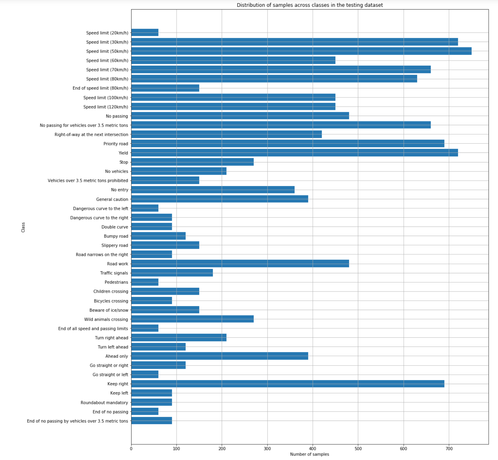

# **Traffic Sign Recognition** 

### 1. Data Set Summary & Exploration

I used the pandas library to calculate summary statistics of the traffic
signs data set:

* The size of training set is 34799
* The size of the validation set is 4410
* The size of test set is 12630
* The shape of a traffic sign image is (32, 32, 3)
* The number of unique classes/labels in the data set is 43

In the following figure a sample of the data set is shown:

The distribution of the classes in the training set:

The distribution of the classes in the validation set:

The distribution of the classes in the testing set:

As we can see from the figures above, the classes are not balanced. Some have almost 10 times more samples than the others.

### 2. Data Preparation

##### Data Augmentation

The number of samples in the training set is increased by artificially augmenting the data. This is done by randomly picking one sample from the existing set, making small alternation to it, and adding the newly created sample to the training dataset. This process is repeated until the desired number of samples is reached.

Three types of alternation are done for each newly generated image: image rotation, translation and saturation scaling.

The training dataset is augmented in a way that each class has the same number of samples: 15000. This will help in balancing the classes and prevent some overfitting of the weights to the training set.

##### Data Preprocessing

First step is conversion to grayscale. Some early testing showed better results than training with the original color images. The second step is adaptive histogram equalization of the images using CLAHE algorithm and cv2.createCLAHE function. This makes all the images similar in terms of contrast.

Here are some samples of augmented and preprocessed dataset:

##### Data Normalization

All three datasets are normalized with the mean and standard deviation values of the training set. 

### 3. Architecture

My final model consisted of the following layers:

| Layer         		|     Description	        					| 
|:---------------------:|:---------------------------------------------:| 
| Input         		| 32x32x1 grayscale image   					| 
| Convolution 3x3     	| 1x1 stride, valid padding, outputs 28x28x100 	|
| RELU					|												|
| Max pooling	      	| 2x2 stride,  outputs 14x14x100 				|
| Convolution 3x3     	| 1x1 stride, valid padding, outputs 12x12x150 	|
| RELU					|												|
| Max pooling	      	| 2x2 stride,  outputs 6x6x150 					|
| Convolution 3x3     	| 1x1 stride, valid padding, outputs 4x4x250 	|
| RELU					|												|
| Max pooling	      	| 2x2 stride,  outputs 2x2x250 					|
| Fully connected		| outputs 200        							|
| RELU					|												|
| Fully connected		| outputs 43        							|
| Softmax				|												|

The architecture is similar to the one used in \[1\]. The architecture presented in the paper produced very high score on a similar task. This is the reason why it used here. The LeNET architecture presented in the course was unable to score high enough.

Dropout is considered and tested, but it didn't show any improvement. It just slowed down the learning and slightly decreased the validation set accuracy.

### 4. Training

##### Loss Function

For the training of the model focal loss is used as presented in \[2\]. It focuses on border cases, i.e. on the small number of samples that tend to be "indecisive", and puts less weight on samples that are "easy" to classify correctly. It led to around 1% bump in the validation set accuracy.

##### Optimizer

ADAM Optimizer is used - the same one in LeNET example.

##### Hyperparameters

For batch size 64 is used. Learning rate is set to 0.001. Focusing and weighting parameters of focal loss are set to 2 and 0.25 respectively. The model was able to reach the saturation pretty quickly, so the number of epochs is set to 2.

### 5. Results

##### Accuracy

The final accuracy on the test set is **98.28%**

##### Recall

Here is the recall of the testing set:

##### Precision

Here is the precision of the testing set:

##### Confusion Matrix

Here is the confusion matrix of the testing set:

##### Discussion

First approach that was tested was LeNET that didn't produce very high accuracies. My assumption is that this is because of the number of convolutional layers. For the handwritten character recognition 2 layers are probably enough, since 2 levels of features could be assumed. Traffic signs are more complex and probably have at least one higher level of features more to be captured by additional convolutional layers.

Focal loss algorithm seemed as something that should be considered in any classification task, so it is used here, and produced the increase in accuracy.

The batch sizes of 32, 64 and 128 are considered, and 64 produced the best results.

Different learning rates were tested, and the 0.001 seemed as a most stable one that produces high accuracies after very few epochs.
 

### 6. Test a Model on New Images

Here are nine German traffic signs that I found on the web:

Since these images do not comply to the 32x32 standard of input images, it was needed to resize them. This is simply done using cv2.resize function. From that point on the images are treated the same way as the images from the testing set.

All the images were correctly classified. The reasons for this are probably that the signs are clearly visible on each one of them, and centered for all except one image. They also don't suffer from bad illumination conditions or occlusion.

Here are the 5 top probabilities for each image:

The highest probability is practically 1.00 for all except for the speed limit one. This is probably due to the fact that the sign is not centered in the image.

### 7. References

\[1\]: Ciresan, Dan & Meier, Ueli & Masci, Jonathan & Schmidhuber, Jurgen. (2011). "A committee of neural networks for traffic sign classification". Proceedings of the International Joint Conference on Neural Networks. 1918-1921. 10.1109/IJCNN.2011.6033458.

\[2\]: T. Lin, P. Goyal, R. Girshick, K. He and P. Dollár, "Focal Loss for Dense Object Detection," 2017 IEEE International Conference on Computer Vision (ICCV), Venice, 2017, pp. 2999-3007.

